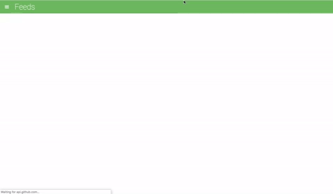

# Welcome to the Feed-Reader

### :book: Instructions:

To run the application, load `index.html` in a web browser, or view it live [here](https://mohampton.github.io/Feed-Reader/).  The tests appear at the bottom of the page.

### :eyeglasses: Project Overview

In this project for the Udacity Front End Web Developer Nanodegree I leveraged [Jasmine](http://jasmine.github.io/) to write tests against a pre-existing application of a RSS feed reader. 

Testing is an important part of the development process and many organizations practice a standard of development known as "test-driven development". This is when developers write tests first, before they ever start developing their application. All the tests initially fail and then they start writing application code to make these tests pass.

### :books: References:

* [Feed Reader Testing, with Ryan Boris](https://www.youtube.com/watch?v=7kOBXPbDmyw)
* Feed Reader Walkthrough, by Matthew Cranford:
    * [Part 1 – Starter Code](https://matthewcranford.com/feed-reader-walkthrough-part-1-starter-code/)
    * [Part 2 – Writing the First Tests](https://matthewcranford.com/feed-reader-walkthrough-part-2-writing-the-first-tests/)
    * [Part 3 – Menu Test Suite](https://matthewcranford.com/feed-reader-walkthrough-part-3-menu-test-suite/)
    * [Part 4 – Async Tests](https://matthewcranford.com/feed-reader-walkthrough-part-4-async-tests/)